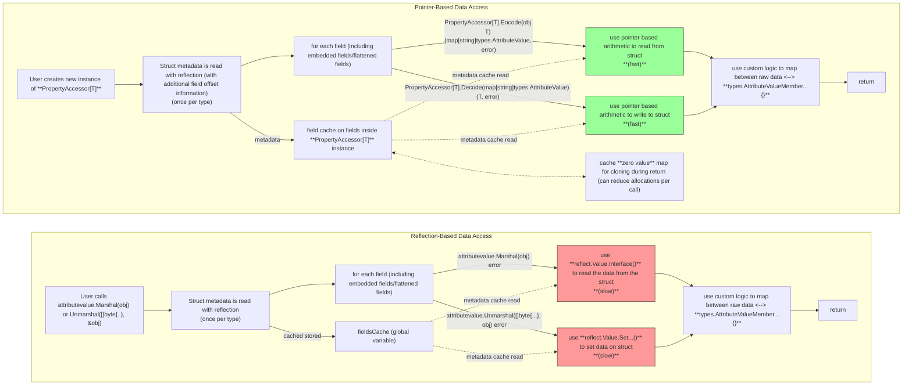

# Reflectionless Data Access - Feature Proposal

> **Purpose:** The `attributevalue` package currently relies heavily on reflection to read from and write to Go structs during DynamoDB serialization and deserialization. This proposal explores an opt-in, reflectionless access path that keeps the familiar struct-and-tag programming model while replacing runtime field access with cached field offsets and pointer-based reads and writes. The goal is to reduce overhead in hot paths without forcing code generation or a radically different user experience.
>
> **Review expectation:** This document is written to support design review and alignment. The primary intent is to validate whether the overall direction, safety boundaries, migration shape, and v1 scope are appropriate before hardening an implementation path.
>
> **Naming convention:** This document uses **Reflectionless Data Access** as the feature name and **PropertyAccessor** as the working API name for examples. These names are illustrative and may change.
>
> **Feedback scope:** We are requesting feedback on whether a one-time reflection plus cached-offset design is an acceptable direction, whether the proposed opt-in API shape is clear, and whether the v1 limitations around unsupported or custom types are reasonable.

### Stakeholders

Owners: Radu Gribincea

Primary Reviewers: DynamoDB Service Team

Secondary Reviewers: Luis Madrigal, Luc Talatinian

### Document Phase

**DRAFT**

## Problem Statement

### What is the problem and why solve it

The current `attributevalue` experience is flexible and familiar, but it pays a runtime cost for that flexibility because it uses reflection extensively when traversing structs. That cost becomes more visible in high-throughput or latency-sensitive workloads where serialization and deserialization sit directly on the request path.

This proposal aims to preserve the existing mental model for customers while reducing the runtime cost of field access. The core idea is to keep reflection only for one-time metadata discovery, then rely on cached field offsets for subsequent reads and writes.

### Why does this problem exist

Reflection was the simplest way to support many shapes of user-defined Go types with minimal upfront work from the customer. That tradeoff made sense when flexibility and broad compatibility mattered more than squeezing out every unit of runtime overhead.

As the performance profile of Go applications becomes more important, and as pointer-safe patterns around cached offsets are better understood, it is reasonable to revisit that tradeoff. There is now a more practical path to reducing reflection in the hot path without requiring users to adopt code generation or handwritten mapping layers.

### How are customers solving this problem today

Many customers using `aws-sdk-go-v2` are not solving it directly. They continue to use `attributevalue` and accept its performance characteristics because it is the supported, ergonomic default. More advanced users sometimes write custom serialization logic, generate code, or maintain manual mapping code for critical paths, but those approaches add complexity and are difficult to maintain consistently.

Some customers also adopt other third-party libraries that implement their own serialization and deserialization layers on top of DynamoDB operations. That is useful evidence that there is real demand for alternatives to the default reflection-heavy path, but those libraries are not part of the AWS SDK and do not address the need for an officially supported, SDK-native approach.

We have also seen cases where Go users in the AWS ecosystem continue to use `aws-sdk-go` v1 instead of v2 because they see better performance characteristics in their workloads. That is another indication that runtime overhead in the data-mapping path can influence adoption decisions.

This also carries ecosystem cost: when performance concerns keep teams on v1, they may defer migration and absorb extra maintenance, testing, and support overhead across SDK versions.

That leaves a gap between convenience and performance. A reflectionless access path is intended to narrow that gap.

### Has a similar problem existed or been solved before

Yes. This problem has appeared before in Go serialization libraries. Some libraries have historically used code generation to avoid reflection. More recently, libraries such as [segmentio/encoding/json](https://github.com/segmentio/encoding/tree/master/json) have shown another approach: keep the API close to the familiar standard-library model while using `unsafe`, pointer arithmetic, and other internal optimizations to reduce reflection in hot paths.

That example is useful because it demonstrates both sides of the tradeoff clearly. It shows that the performance problem is real and that it can be addressed without requiring code generation, but it also reinforces that the implementation must remain disciplined: the API should stay approachable, and the low-level `unsafe` internals should stay tightly contained and carefully maintained.

## Tenets

### Performance without unnecessary ceremony

The design should reduce runtime overhead in common encode and decode paths, and the default adoption path should not require a code-generation step or a new schema language.

### Safety first, even with low-level internals

Any use of `unsafe` must remain internal, well-tested, and narrow in scope. The design should prefer predictable, reviewable patterns over cleverness.

### Familiar adoption path

The customer experience should feel close to the current `attributevalue` model: Go structs, tags, and explicit API calls. Migration should be incremental rather than all-or-nothing.

### Extensibility without penalizing the default path

Where customization is needed, it should be explicit and bounded so that the common case remains simple, fast, and free of edge-case complexity.

### Compatibility where it matters

The proposal should preserve existing `attributevalue` tagging conventions, DynamoDB `AttributeValue` expectations, and familiar AWS SDK usage patterns wherever practical so that adoption does not feel like a rewrite.

## Intended Customer Experience

### Familiar to existing `attributevalue` users

The intended experience is deliberately conservative. Customers still define Go structs, still rely on familiar field tags, and still move between structs and `map[string]types.AttributeValue` values. What changes is the cost model under the hood: one-time reflection for metadata discovery, then cached pointer-based access for runtime reads and writes.

For concrete usage and migration examples, see [Appendix #1: Usage and migration examples](#appendix-1-usage-and-migration-examples).

### What are you launching today

An opt-in, high-performance, modular data access layer for DynamoDB-related struct serialization and deserialization that avoids reflection in the runtime hot path and is designed to be extensible enough for more advanced higher-level packages, such as the proposed Entity Manager.

### Key benefits

The primary value is lower runtime overhead without abandoning the existing struct-based experience. Customers get a path to better performance, fewer allocations in critical flows, and a migration model that does not require generated code or bespoke mapping logic.

### Why should I use this feature

Use this feature when serialization and deserialization overhead is showing up in your profiles, latency, or CPU cost and you want a more efficient implementation without giving up the current typed struct-and-tag model or explicit API usage.

### How do I use this feature

The working model is a reusable accessor that is created once for a struct type and then reused across encode and decode operations. The examples in this document are intentionally lightweight in the main narrative; detailed snippets are in [Appendix #1: Usage and migration examples](#appendix-1-usage-and-migration-examples), and the low-level implementation mechanics are in [Appendix #2: Pointer-based access internals](#appendix-2-pointer-based-access-internals).

### How does this feature relate to other AWS services

This proposal is focused on DynamoDB data mapping in the Go SDK. It is designed to remain compatible with existing DynamoDB `AttributeValue` conventions and to fit naturally alongside current AWS SDK usage patterns. The initial focus is core DynamoDB data mapping, but the design should also be reusable in adjacent DynamoDB-related integrations such as DynamoDB Streams and DAX where the underlying data model overlaps.

## Design Decisions at a Glance

1. Runtime field access should use cached offsets and pointer arithmetic instead of reflection.
2. Reflection should remain in the system only for one-time metadata discovery and validation.
3. Metadata and offsets should be cached in memory for the lifetime of the process.
4. The API should remain opt-in and additive rather than replacing the current experience.
5. Unsafe operations should remain internal and hidden behind tested library boundaries.
6. Complex or non-standard cases should fail clearly or require explicit customization rather than relying on fragile magic.

Detailed rationale is in [Detailed Design Decisions and Tradeoffs](#detailed-design-decisions-and-tradeoffs) and [Appendix #6: Important design decisions and tradeoffs](#appendix-6-important-design-decisions-and-tradeoffs).

## High-Level Design

At a high level, the design splits the work into two phases. During setup, reflection is used to inspect a struct type, interpret tags, and cache field offsets and related metadata. During steady-state runtime operations, that cached metadata drives direct field access without re-entering the reflection path for every field.

This keeps the dynamic part of the problem in a one-time setup phase and keeps the per-call path focused on predictable memory access and normal DynamoDB value conversion.

For the detailed flow and diagram, see [Appendix #2: Pointer-based access internals](#appendix-2-pointer-based-access-internals) and [Appendix #3: High-level design diagram](#appendix-3-high-level-design-diagram).

## Limitations of the Design

This proposal deliberately accepts a tighter implementation boundary in exchange for performance. It depends on careful internal handling of `unsafe`, continues to require reflection during metadata discovery, and may need explicit customization or clear rejection for types with unusual layouts or serialization behavior.

It also depends on Go runtime and compiler behavior remaining compatible with the assumptions behind cached field offsets. That does not make the approach unsafe by default, but it does raise the maintenance and validation bar.

For the full limitations and dependency details, see [Appendix #5: Detailed limitations and dependencies](#appendix-5-detailed-limitations-and-dependencies).

## Dependencies Taken

The design depends primarily on the Go runtime, the Go `reflect` and `unsafe` packages, and the existing DynamoDB `AttributeValue` model in the AWS SDK for Go v2. It does not require external generators, schema registries, or persistent caches.

That keeps the operational footprint simple, but it also means compatibility with future Go runtime changes must be monitored carefully.

## Detailed Design Decisions and Tradeoffs

Several key design decisions shape this proposal:

1. **Decision point:** How should runtime field access work?
   **Recommended solution:** Use pointer-based access after one-time reflection discovers field metadata and offsets.
   **Feedback requested:** Is the performance and simplicity tradeoff strong enough to justify introducing internal `unsafe` usage?

2. **Decision point:** When should metadata be extracted?
   **Recommended solution:** Extract metadata at accessor construction time or first use, then cache it for reuse.
   **Feedback requested:** Is the one-time startup cost acceptable in exchange for a cheaper steady-state path?

3. **Decision point:** What should the API surface look like?
   **Recommended solution:** Keep the API opt-in and close to existing `attributevalue` usage patterns through a reusable accessor or schema abstraction.
   **Feedback requested:** Is the proposed migration shape sufficiently clear, or should the API be even closer to existing package entry points?

4. **Decision point:** How should customization work?
   **Recommended solution:** Allow custom handlers or extension points for special cases while keeping the default path minimal.
   **Feedback requested:** Where should the boundary between built-in support and user customization sit for v1?

5. **Decision point:** How should unsupported cases behave?
   **Recommended solution:** Return clear errors for layouts or behaviors that cannot be handled safely or predictably, rather than silently falling back to fragile behavior.
   **Feedback requested:** Which unsupported cases should be explicit in v1 documentation and validation?

Supporting low-level examples and the more exhaustive tradeoff list are in [Appendix #2: Pointer-based access internals](#appendix-2-pointer-based-access-internals) and [Appendix #6: Important design decisions and tradeoffs](#appendix-6-important-design-decisions-and-tradeoffs).

## Rollout and Rollback Strategy

### Rollout Strategy

The recommended rollout is incremental and opt-in. Teams should be able to introduce the reflectionless model one struct or code path at a time without changing stored data formats or rewriting existing code. A feature flag, explicit constructor boundary, or similar opt-in mechanism may be appropriate during the transition period.

Documentation and migration examples should accompany rollout so that users understand both the value proposition and the limitations before adopting the feature.

### Rollback Strategy

Rollback should be straightforward because the proposal does not change DynamoDB wire formats or introduce persistent state. If issues arise, callers can return to the existing reflection-based path by removing the opt-in usage or otherwise disabling the reflectionless path.

Because metadata is cached only in memory, there is no cleanup or migration work associated with reverting.

## Impact of the Design

### Performance

The expected impact is reduced runtime overhead for struct field access during encode and decode operations. Preliminary proof-of-concept benchmarks already show promising results, as summarized in [Appendix #7: Benchmarks](#appendix-7-benchmarks), but broader benchmark validation will still be a required part of evaluation and rollout.

### Security and Privacy

The proposal does not change the data model, access controls, or logging posture. User data should remain outside logs, and errors should stay actionable without exposing sensitive content.

### Future Projects

If successful, this design could inform similar optimizations in other SDK components where repeated reflection remains on critical paths. In particular, there is a follow up plan to update the proposal and implementation for the new entity manager to use this package as its underlying data-mapping layer. That is also one reason this design should remain meaningfully extendable: higher-level packages may need to layer on additional schema, conversion, or lifecycle behavior without giving up the performance benefits of the core access path. It may also provide a foundation for future work that precomputes mapping metadata ahead of runtime if that becomes useful.

### Testing

Testing must go beyond ordinary unit coverage. The design needs unit tests, integration tests, property-based or fuzz-style validation where appropriate, and benchmarks that confirm the added complexity is providing real value. It should also be exercised across supported Go versions to reduce the risk of layout or runtime assumptions drifting silently.

### Operations and Operational Tooling

No new operational tooling is required. The main operational responsibility is disciplined validation during rollout and after Go or SDK upgrades.

### Existing Features and Services

This is an additive, client-side optimization. It is intended to work with existing DynamoDB SDK patterns and should not require service-side changes.

## Open Questions and Next Steps

- What should the public v1 API be: a focused accessor abstraction only, or a broader schema-oriented surface?
- Which field shapes or behaviors should be explicitly out of scope for v1 rather than supported through complex internal logic?
- Do we want a feature flag, build tag, or purely explicit API boundary for rollout?
- What benchmark thresholds are sufficient to justify the added implementation complexity?
- What minimum test matrix is required to build confidence across Go versions and runtime updates?

## Key Feedback

No formal review notes are captured in this draft yet. Review-session notes, decisions, open questions, and action items should be recorded in [Meeting Notes](#meeting-notes) as reviews progress.

## Appendix

### Appendix #1: Usage and migration examples

The examples below are intentionally kept out of the main narrative so the proposal stays readable at review time.

**Defining models**

```go
type simpleOrder struct {
	OrderID     string  `dynamodbav:"order_id"`
	CreatedAt   int64   `dynamodbav:"created_at"`
	CustomerID  string  `dynamodbav:"customer_id"`
	TotalAmount float64 `dynamodbav:"total"`
}
```

**Encoding and decoding**

```go
p := NewPropertyAccessor[simpleOrder]()
m, err := p.Encode(&order)
// m is a map[string]types.AttributeValue ready for DynamoDB API calls

order, err := p.Decode(map[string]types.AttributeValue{...})
// order is a T (simpleOrder{} in this case)
```

**Example migration**

Old:

```go
var order simpleOrder
item := getFromDynamoDB(...)
err := attributevalue.UnmarshalMap(item, &order)
```

New:

```go
accessor := NewPropertyAccessor[simpleOrder]()
item := getFromDynamoDB(...)
order, err := accessor.Decode(item)
```

Many straightforward existing models may require no changes beyond the accessor instantiation and method calls.

### Appendix #2: Pointer-based access internals

The core implementation idea is to use reflection only when building the accessor so the library can inspect fields, parse tags, and cache offsets. After that, runtime access can proceed through pointer arithmetic instead of `reflect.Value` reads and writes.

This keeps reflection out of the steady-state path while preserving the existing struct-based programming model.

Under the hood, the flow looks roughly like this:

```go
type field struct {
	Name        string
	NameFromTag bool
	Offset      uintptr
}

f := field{Offset: unsafe.Offsetof(user{}.Id)}

object := user{
	Id: "some-id",
}

ptr := unsafe.Pointer(&object)

val := *(*string)(unsafe.Pointer(
   uintptr(ptr) + f.Offset,
))

*(*string)(unsafe.Pointer(uintptr(ptr) + f.Offset)) = "new value"

func memcpy(dst, src unsafe.Pointer, size uintptr) {
	dstSlice := unsafe.Slice((*byte)(dst), size)
	srcSlice := unsafe.Slice((*byte)(src), size)
	copy(dstSlice, srcSlice)
}
```

The proof-of-concept reference noted during exploration is here: <https://gist.github.com/raduendv/1827d71040fec9a529e618aba015f96d>

### Appendix #3: High-level design diagram



### Appendix #4: Safe pointer arithmetic practices

- All pointer arithmetic should remain encapsulated within internal, well-tested library code.
- `unsafe` should never be exposed as part of the public customer experience.
- Static analysis tools such as `go vet` and `staticcheck` should be used to catch common misuse patterns.
- Fuzzing and targeted property-based tests should be used to exercise subtle layout and conversion edge cases.
- Go release notes should be monitored for changes that might affect struct layout or memory-model assumptions.

### Appendix #5: Detailed limitations and dependencies

**Limitations**

- **Unsafe pointer usage:** The design relies on Go's `unsafe` package for pointer arithmetic. While performant, incorrect pointer calculations can lead to undefined behavior or memory safety issues.
- **Limited support for non-standard types:** Types that require custom serialization logic or have non-trivial memory layouts, such as embedded interfaces, unexported fields, or complex nested types, may not be fully supported out of the box.
- **Reflection still required for metadata:** Initial metadata extraction still uses reflection, even if only once per type.
- **Compatibility with Go runtime:** The use of `unsafe` and reliance on Go's memory model may be sensitive to future runtime or compiler changes.
- **Portability and tooling:** Some tools may be less effective when code relies heavily on pointer arithmetic.
- **Debuggability:** Pointer-related issues can be harder to debug than reflection-based failures.

**Dependencies**

- **Go runtime and compiler:** The design depends on the stability of struct layouts and the behavior of `unsafe`.
- **AWS SDK for Go v2:** The design stays aligned with DynamoDB types and `attributevalue` conventions.
- **Reflection package:** Reflection remains necessary for metadata extraction.
- **Standard library:** The implementation relies on `reflect`, `unsafe`, and related packages.
- **No external persistent cache:** All metadata and offsets are cached in memory per process.

**Resilience considerations**

If any of these dependencies change materially, the design will need validation and possibly targeted updates. The mapping layer itself does not introduce external service dependencies that would affect availability or latency at runtime.

### Appendix #6: Important design decisions and tradeoffs

### 1. Reflection vs. pointer arithmetic for field access

**Decision:** Use safe pointer arithmetic for struct field access instead of reflection.

**Tradeoff:** Pointer arithmetic can improve performance and reduce memory allocations, but it requires careful handling to maintain type and memory safety. Reflection is more flexible and broadly applicable, but incurs higher runtime costs.

### 2. Metadata extraction timing

**Decision:** Perform reflection-based metadata extraction once per struct type at startup or first use, then cache results in memory.

**Tradeoff:** This approach minimizes reflection overhead while ensuring that field offsets are accurate for the running binary. The tradeoff is a small upfront cost at startup, but no runtime penalty for subsequent accesses.

### 3. In-memory caching of offsets

**Decision:** Cache all metadata and field offsets in memory, per process, with no external or persistent storage.

**Tradeoff:** This keeps the design simple and correct for the running process. The tradeoff is that struct changes still require a rebuild and restart, which is normal for Go applications.

### 4. Extensibility for custom serialization behavior

**Decision:** Allow advanced users to extend or override serialization and deserialization logic for special field types or behaviors.

**Tradeoff:** This adds some API complexity, but it enables power users to handle edge cases without sacrificing the performance benefits of the default design.

### 5. Compatibility with existing SDK patterns

**Decision:** Maintain compatibility with existing `attributevalue` conventions and AWS SDK idioms wherever possible.

**Tradeoff:** This creates a smoother migration path, but it may limit how far the API can diverge toward new abstractions.

### 6. Use of Go's `unsafe` package

**Decision:** Rely on Go's `unsafe` package for pointer arithmetic, with strict internal controls and documentation.

**Tradeoff:** This enables high performance, but it increases the importance of code review, testing, and ongoing compatibility validation.

### Appendix #7: Benchmarks

#### Benchmark sources and execution model

This appendix now combines two benchmark datasets that measure similar serialization and deserialization paths from different angles.

1. **CloudWatch workload benchmarks** (existing sections below)
   - Source: CloudWatch metrics emitted by benchmark workloads against DynamoDB APIs.
   - Data shape: per `(sdk, arch, operation, size)` tuple.
   - Metrics: latency percentiles and extrema in **µs**, plus operation-overhead ratios.
   - Example collection configuration used for this report snapshot:
     - Region: `eu-west-1`
     - Window: `2026-04-28T03:05:51Z` to `2026-04-28T15:05:51Z`
     - Period: `300s`

2. **Go test microbenchmarks**
   - Source: Go benchmark output rows for `Benchmark_*_(MarshalMap|UnmarshalMap)_User<size>`.
   - Aggregation: arithmetic mean across files for each `(sdk, arch, operation, size)` tuple.
   - Metrics: `ns/op`, `B/op`, and `allocs/op`.
   - Scope: `User` entity payload targets (`1KB`, `10KB`, `100KB`, `300KB`).

#### Go test aggregated benchmark results

> Data collected from go test benchmark output aggregation.
> Aggregation uses arithmetic mean across files for each `(sdk, arch, operation, size)` tuple.
> `MarshalMap` = struct -> `map[string]types.AttributeValue`; `UnmarshalMap` = reverse mapping.

##### Test entities

- `User` benchmark entity at payload targets: `1KB`, `10KB`, `100KB`, `300KB`.
  - Scalar fields: strings, numbers, booleans.
  - Optional/pointer fields, including optional nested objects.
  - Temporal fields: `time.Time` and optional timestamps.
  - Collections: byte slice, string lists, and maps.
  - Nested structs: `Address` list/object and embedded `Timestampable` metadata.
- This mix is intended to stress realistic `dynamodbav` mapping paths (nested structs, optional values, collections, and timestamps).
- Current report scope: `User` entity only; primitive-type entity benchmarks are not included in these tables.

##### Go test conclusions

- **Execution Speed**
  - **MarshalMap**
    - v2 vs v1: 28.59% faster on average across 8 arch/size combinations.
    - v2-codegen vs v2: wins 6/8 (75.00%), by 4.66% on average when it wins.
    - v2-ptr vs v2: wins 8/8 (100.00%), by 63.43% on average when it wins.
  - **UnmarshalMap**
    - v2 vs v1: 5.24% slower on average across 8 arch/size combinations.
    - v2-codegen vs v2: wins 8/8 (100.00%), by 33.82% on average when it wins.
    - v2-ptr vs v2: wins 8/8 (100.00%), by 81.14% on average when it wins.
- **Allocations**
  - **MarshalMap**
    - v2 vs v1: 23.31% fewer allocations on average across 8 arch/size combinations.
    - v2-codegen vs v2: lower allocs in 6/8 (75.00%), by 4.86% on average when it wins.
    - v2-ptr vs v2: lower allocs in 8/8 (100.00%), by 69.68% on average when it wins.
  - **UnmarshalMap**
    - v2 vs v1: 9.90% more allocations on average across 8 arch/size combinations.
    - v2-codegen vs v2: lower allocs in 0/8 (0.00%); higher allocs in 8/8 (100.00%), by 26.16% on average when it loses.
    - v2-ptr vs v2: lower allocs in 8/8 (100.00%), by 80.60% on average when it wins.

For full per-arch, per-size go test tables (`ns/op`, `B/op`, `allocs/op`, and baseline deltas), see `output-benchmarks.md`.

#### CloudWatch workload benchmark results

> Data collected from CloudWatch. All durations are in **µs** (microseconds).
> `MarshalMap` = struct → `map[string]types.AttributeValue`; `UnmarshalMap` = `map[string]types.AttributeValue` → struct.
> `—` indicates no data was available for that combination.

#### MarshalMap

**Arch: arm64 — 1KB**

| SDK        |  Average |      p50 |      p90 |      p95 |      p99 |      Min |       Max |
| ---------- | -------: | -------: | -------: | -------: | -------: | -------: | --------: |
| v1         | 31.38 µs | 31.15 µs | 40.40 µs | 43.57 µs | 52.76 µs | 16.07 µs | 218.10 µs |
| v2         | 29.40 µs | 28.28 µs | 38.65 µs | 40.95 µs | 49.69 µs | 15.85 µs | 136.35 µs |
| v2-codegen | 20.58 µs | 19.85 µs | 27.73 µs | 30.35 µs | 36.93 µs | 10.05 µs | 121.78 µs |
| v2-ptr     | 10.96 µs |  9.34 µs | 16.87 µs | 18.00 µs | 23.20 µs |  6.85 µs | 314.53 µs |

**Arch: arm64 — 10KB**

| SDK        |  Average |      p50 |      p90 |      p95 |      p99 |      Min |       Max |
| ---------- | -------: | -------: | -------: | -------: | -------: | -------: | --------: |
| v1         | 31.88 µs | 31.53 µs | 40.81 µs | 44.04 µs | 53.72 µs | 16.44 µs | 201.46 µs |
| v2         | 29.91 µs | 28.91 µs | 38.96 µs | 41.35 µs | 50.84 µs | 16.48 µs | 158.05 µs |
| v2-codegen | 20.76 µs | 19.97 µs | 27.95 µs | 30.61 µs | 37.50 µs |  9.98 µs | 126.02 µs |
| v2-ptr     | 10.87 µs |  9.40 µs | 16.53 µs | 17.39 µs | 22.42 µs |  6.96 µs | 341.30 µs |

**Arch: arm64 — 100KB**

| SDK        |  Average |      p50 |      p90 |      p95 |      p99 |      Min |       Max |
| ---------- | -------: | -------: | -------: | -------: | -------: | -------: | --------: |
| v1         | 32.19 µs | 31.56 µs | 41.84 µs | 45.13 µs | 54.64 µs | 16.64 µs | 230.81 µs |
| v2         | 30.20 µs | 28.91 µs | 39.77 µs | 43.06 µs | 52.56 µs | 16.22 µs | 175.83 µs |
| v2-codegen | 20.95 µs | 20.01 µs | 28.59 µs | 31.56 µs | 38.33 µs | 10.07 µs | 154.93 µs |
| v2-ptr     | 11.05 µs |  9.46 µs | 16.88 µs | 17.87 µs | 23.34 µs |  6.97 µs | 446.99 µs |

**Arch: arm64 — 300KB**

| SDK        |  Average |      p50 |      p90 |      p95 |      p99 |      Min |       Max |
| ---------- | -------: | -------: | -------: | -------: | -------: | -------: | --------: |
| v1         | 28.63 µs | 29.45 µs | 42.87 µs | 47.20 µs | 55.68 µs | 10.23 µs | 259.20 µs |
| v2         | 26.18 µs | 26.89 µs | 41.05 µs | 44.77 µs | 53.88 µs |  8.19 µs | 186.48 µs |
| v2-codegen | 18.69 µs | 18.83 µs | 29.39 µs | 32.56 µs | 39.00 µs |  6.13 µs | 164.67 µs |
| v2-ptr     | 11.13 µs |  9.45 µs | 17.06 µs | 18.33 µs | 23.99 µs |  6.91 µs | 424.64 µs |

**Arch: amd64 — 1KB**

| SDK        |  Average |      p50 |      p90 |      p95 |      p99 |     Min |       Max |
| ---------- | -------: | -------: | -------: | -------: | -------: | ------: | --------: |
| v1         | 20.77 µs | 17.83 µs | 28.56 µs | 33.79 µs | 69.01 µs | 7.99 µs | 309.66 µs |
| v2         | 17.72 µs | 14.55 µs | 25.23 µs | 29.07 µs | 59.83 µs | 6.75 µs | 204.04 µs |
| v2-codegen | 12.66 µs | 10.95 µs | 18.65 µs | 21.29 µs | 43.81 µs | 4.34 µs | 158.25 µs |
| v2-ptr     |  6.90 µs |  4.91 µs | 10.74 µs | 12.51 µs | 32.85 µs | 3.01 µs | 189.43 µs |

**Arch: amd64 — 10KB**

| SDK        |  Average |      p50 |      p90 |      p95 |      p99 |     Min |       Max |
| ---------- | -------: | -------: | -------: | -------: | -------: | ------: | --------: |
| v1         | 21.13 µs | 18.21 µs | 29.10 µs | 34.16 µs | 68.86 µs | 8.47 µs | 288.21 µs |
| v2         | 18.04 µs | 15.07 µs | 25.60 µs | 29.33 µs | 62.27 µs | 6.63 µs | 188.48 µs |
| v2-codegen | 12.67 µs | 10.98 µs | 18.64 µs | 21.28 µs | 43.04 µs | 4.50 µs | 171.73 µs |
| v2-ptr     |  6.92 µs |  4.92 µs | 10.71 µs | 12.49 µs | 32.78 µs | 3.00 µs | 204.83 µs |

**Arch: amd64 — 100KB**

| SDK        |  Average |      p50 |      p90 |      p95 |      p99 |     Min |       Max |
| ---------- | -------: | -------: | -------: | -------: | -------: | ------: | --------: |
| v1         | 21.25 µs | 18.23 µs | 28.52 µs | 34.16 µs | 79.01 µs | 8.47 µs | 366.67 µs |
| v2         | 18.14 µs | 14.86 µs | 25.66 µs | 29.80 µs | 71.03 µs | 7.16 µs | 318.51 µs |
| v2-codegen | 12.83 µs | 10.94 µs | 18.77 µs | 21.84 µs | 49.52 µs | 4.55 µs | 226.47 µs |
| v2-ptr     |  6.92 µs |  4.90 µs | 10.71 µs | 12.37 µs | 32.84 µs | 3.00 µs | 345.57 µs |

**Arch: amd64 — 300KB**

| SDK        |  Average |      p50 |      p90 |      p95 |      p99 |     Min |       Max |
| ---------- | -------: | -------: | -------: | -------: | -------: | ------: | --------: |
| v1         | 19.33 µs | 17.41 µs | 29.02 µs | 34.45 µs | 79.10 µs | 5.16 µs | 369.26 µs |
| v2         | 16.15 µs | 13.82 µs | 25.74 µs | 30.18 µs | 71.73 µs | 4.13 µs | 303.44 µs |
| v2-codegen | 11.67 µs | 10.50 µs | 18.59 µs | 21.67 µs | 48.89 µs | 3.10 µs | 223.46 µs |
| v2-ptr     |  6.90 µs |  4.94 µs | 10.58 µs | 12.42 µs | 32.68 µs | 3.00 µs | 369.21 µs |

#### UnmarshalMap

**Arch: arm64 — 1KB**

| SDK        |  Average |      p50 |      p90 |      p95 |      p99 |      Min |       Max |
| ---------- | -------: | -------: | -------: | -------: | -------: | -------: | --------: |
| v1         | 29.37 µs | 29.92 µs | 35.06 µs | 37.04 µs | 47.33 µs |  8.97 µs | 343.23 µs |
| v2         | 35.70 µs | 36.50 µs | 43.30 µs | 45.43 µs | 57.21 µs | 11.84 µs | 505.58 µs |
| v2-codegen | 22.97 µs | 22.92 µs | 27.90 µs | 30.16 µs | 39.01 µs |  7.42 µs | 406.87 µs |
| v2-ptr     |  7.00 µs |  6.91 µs | 11.63 µs | 13.21 µs | 17.39 µs |  2.05 µs | 206.12 µs |

**Arch: arm64 — 10KB**

| SDK        |  Average |      p50 |      p90 |      p95 |      p99 |      Min |       Max |
| ---------- | -------: | -------: | -------: | -------: | -------: | -------: | --------: |
| v1         | 29.42 µs | 29.91 µs | 35.06 µs | 37.03 µs | 47.25 µs |  8.77 µs | 386.21 µs |
| v2         | 35.27 µs | 35.79 µs | 42.70 µs | 44.96 µs | 56.69 µs | 13.14 µs | 481.34 µs |
| v2-codegen | 22.81 µs | 22.73 µs | 27.77 µs | 29.95 µs | 38.82 µs |  7.39 µs | 413.72 µs |
| v2-ptr     |  7.00 µs |  6.94 µs | 11.57 µs | 13.13 µs | 17.37 µs |  2.12 µs | 168.23 µs |

**Arch: arm64 — 100KB**

| SDK        |  Average |      p50 |      p90 |      p95 |      p99 |      Min |       Max |
| ---------- | -------: | -------: | -------: | -------: | -------: | -------: | --------: |
| v1         | 29.61 µs | 30.17 µs | 35.27 µs | 37.13 µs | 47.35 µs | 10.03 µs | 336.80 µs |
| v2         | 35.63 µs | 36.18 µs | 43.07 µs | 45.23 µs | 57.01 µs | 13.03 µs | 486.27 µs |
| v2-codegen | 23.03 µs | 22.94 µs | 27.90 µs | 30.22 µs | 39.29 µs |  7.52 µs | 417.88 µs |
| v2-ptr     |  7.10 µs |  7.06 µs | 11.69 µs | 13.31 µs | 17.55 µs |  2.04 µs | 176.46 µs |

**Arch: arm64 — 300KB**

| SDK        |  Average |      p50 |      p90 |      p95 |      p99 |      Min |       Max |
| ---------- | -------: | -------: | -------: | -------: | -------: | -------: | --------: |
| v1         | 29.81 µs | 30.14 µs | 34.94 µs | 36.99 µs | 47.56 µs |  6.68 µs | 435.15 µs |
| v2         | 36.59 µs | 36.77 µs | 43.41 µs | 45.70 µs | 57.68 µs | 10.93 µs | 465.30 µs |
| v2-codegen | 23.41 µs | 23.22 µs | 27.86 µs | 30.14 µs | 39.36 µs |  6.21 µs | 385.09 µs |
| v2-ptr     |  7.06 µs |  6.93 µs | 11.66 µs | 13.28 µs | 17.48 µs |  2.08 µs | 187.84 µs |

**Arch: amd64 — 1KB**

| SDK        |  Average |      p50 |      p90 |      p95 |      p99 |     Min |       Max |
| ---------- | -------: | -------: | -------: | -------: | -------: | ------: | --------: |
| v1         | 18.46 µs | 17.52 µs | 21.45 µs | 27.41 µs | 71.74 µs | 4.56 µs | 240.56 µs |
| v2         | 20.18 µs | 20.24 µs | 24.74 µs | 27.63 µs | 36.89 µs | 6.13 µs | 238.02 µs |
| v2-codegen | 15.36 µs | 14.44 µs | 18.45 µs | 23.59 µs | 61.42 µs | 3.48 µs | 242.78 µs |
| v2-ptr     |  4.79 µs |  4.73 µs |  6.17 µs |  7.88 µs | 20.52 µs | 1.00 µs | 297.46 µs |

**Arch: amd64 — 10KB**

| SDK        |  Average |      p50 |      p90 |      p95 |      p99 |     Min |       Max |
| ---------- | -------: | -------: | -------: | -------: | -------: | ------: | --------: |
| v1         | 18.41 µs | 17.44 µs | 21.46 µs | 27.42 µs | 71.25 µs | 5.16 µs | 265.96 µs |
| v2         | 20.26 µs | 20.32 µs | 24.82 µs | 27.66 µs | 36.75 µs | 6.18 µs | 263.52 µs |
| v2-codegen | 15.35 µs | 14.50 µs | 18.44 µs | 23.40 µs | 61.05 µs | 3.66 µs | 221.99 µs |
| v2-ptr     |  4.82 µs |  4.73 µs |  6.16 µs |  7.85 µs | 20.59 µs | 1.00 µs | 289.66 µs |

**Arch: amd64 — 100KB**

| SDK        |  Average |      p50 |      p90 |      p95 |      p99 |     Min |       Max |
| ---------- | -------: | -------: | -------: | -------: | -------: | ------: | --------: |
| v1         | 18.36 µs | 17.41 µs | 21.35 µs | 27.06 µs | 71.13 µs | 4.57 µs | 283.09 µs |
| v2         | 20.44 µs | 20.58 µs | 25.01 µs | 27.80 µs | 36.76 µs | 6.12 µs | 253.75 µs |
| v2-codegen | 15.39 µs | 14.57 µs | 18.53 µs | 23.58 µs | 61.48 µs | 3.34 µs | 266.76 µs |
| v2-ptr     |  4.87 µs |  4.74 µs |  6.36 µs |  7.92 µs | 20.70 µs | 1.00 µs | 285.89 µs |

**Arch: amd64 — 300KB**

| SDK        |  Average |      p50 |      p90 |      p95 |      p99 |     Min |       Max |
| ---------- | -------: | -------: | -------: | -------: | -------: | ------: | --------: |
| v1         | 18.75 µs | 17.48 µs | 21.69 µs | 27.67 µs | 71.50 µs | 2.78 µs | 265.28 µs |
| v2         | 20.92 µs | 20.67 µs | 25.16 µs | 28.07 µs | 37.05 µs | 4.42 µs | 244.77 µs |
| v2-codegen | 15.97 µs | 14.98 µs | 18.81 µs | 24.36 µs | 61.70 µs | 1.98 µs | 265.63 µs |
| v2-ptr     |  4.85 µs |  4.75 µs |  6.38 µs |  7.91 µs | 20.66 µs | 1.00 µs | 285.68 µs |

#### Overhead vs baseline

> `v2` is compared against `v1`; `v2-codegen` and `v2-ptr` are compared against `v2`.
> Positive values mean slower than the baseline; negative values mean faster.

> Metric basis: `Δ avg` uses `Average` latency; `Δ p50` uses `p50` latency for `MarshalMap` / `UnmarshalMap`.

##### MarshalMap

**Arch: arm64 — 1KB**

| SDK        | Baseline |  Average |               Δ avg |      p50 |               Δ p50 |
| ---------- | -------- | -------: | ------------------: | -------: | ------------------: |
| v1         | —        | 31.38 µs |                   — | 31.15 µs |                   — |
| v2         | v1       | 29.40 µs |   -1.98 µs (-6.31%) | 28.28 µs |   -2.87 µs (-9.20%) |
| v2-codegen | v2       | 20.58 µs |  -8.82 µs (-30.00%) | 19.85 µs |  -8.43 µs (-29.82%) |
| v2-ptr     | v2       | 10.96 µs | -18.44 µs (-62.73%) |  9.34 µs | -18.94 µs (-66.98%) |

**Arch: arm64 — 10KB**

| SDK        | Baseline |  Average |               Δ avg |      p50 |               Δ p50 |
| ---------- | -------- | -------: | ------------------: | -------: | ------------------: |
| v1         | —        | 31.88 µs |                   — | 31.53 µs |                   — |
| v2         | v1       | 29.91 µs |   -1.97 µs (-6.17%) | 28.91 µs |   -2.61 µs (-8.28%) |
| v2-codegen | v2       | 20.76 µs |  -9.16 µs (-30.61%) | 19.97 µs |  -8.94 µs (-30.93%) |
| v2-ptr     | v2       | 10.87 µs | -19.04 µs (-63.66%) |  9.40 µs | -19.52 µs (-67.50%) |

**Arch: arm64 — 100KB**

| SDK        | Baseline |  Average |               Δ avg |      p50 |               Δ p50 |
| ---------- | -------- | -------: | ------------------: | -------: | ------------------: |
| v1         | —        | 32.19 µs |                   — | 31.56 µs |                   — |
| v2         | v1       | 30.20 µs |   -1.98 µs (-6.16%) | 28.91 µs |   -2.65 µs (-8.39%) |
| v2-codegen | v2       | 20.95 µs |  -9.25 µs (-30.64%) | 20.01 µs |  -8.91 µs (-30.80%) |
| v2-ptr     | v2       | 11.05 µs | -19.15 µs (-63.41%) |  9.46 µs | -19.45 µs (-67.29%) |

**Arch: arm64 — 300KB**

| SDK        | Baseline |  Average |               Δ avg |      p50 |               Δ p50 |
| ---------- | -------- | -------: | ------------------: | -------: | ------------------: |
| v1         | —        | 28.63 µs |                   — | 29.45 µs |                   — |
| v2         | v1       | 26.18 µs |   -2.45 µs (-8.56%) | 26.89 µs |   -2.56 µs (-8.70%) |
| v2-codegen | v2       | 18.69 µs |  -7.49 µs (-28.63%) | 18.83 µs |  -8.06 µs (-29.97%) |
| v2-ptr     | v2       | 11.13 µs | -15.06 µs (-57.50%) |  9.45 µs | -17.44 µs (-64.87%) |

**Arch: amd64 — 1KB**

| SDK        | Baseline |  Average |               Δ avg |      p50 |              Δ p50 |
| ---------- | -------- | -------: | ------------------: | -------: | -----------------: |
| v1         | —        | 20.77 µs |                   — | 17.83 µs |                  — |
| v2         | v1       | 17.72 µs |  -3.05 µs (-14.68%) | 14.55 µs | -3.27 µs (-18.36%) |
| v2-codegen | v2       | 12.66 µs |  -5.06 µs (-28.55%) | 10.95 µs | -3.60 µs (-24.76%) |
| v2-ptr     | v2       |  6.90 µs | -10.83 µs (-61.09%) |  4.91 µs | -9.64 µs (-66.27%) |

**Arch: amd64 — 10KB**

| SDK        | Baseline |  Average |               Δ avg |      p50 |               Δ p50 |
| ---------- | -------- | -------: | ------------------: | -------: | ------------------: |
| v1         | —        | 21.13 µs |                   — | 18.21 µs |                   — |
| v2         | v1       | 18.04 µs |  -3.10 µs (-14.65%) | 15.07 µs |  -3.14 µs (-17.26%) |
| v2-codegen | v2       | 12.67 µs |  -5.37 µs (-29.78%) | 10.98 µs |  -4.08 µs (-27.09%) |
| v2-ptr     | v2       |  6.92 µs | -11.12 µs (-61.66%) |  4.92 µs | -10.14 µs (-67.33%) |

**Arch: amd64 — 100KB**

| SDK        | Baseline |  Average |               Δ avg |      p50 |              Δ p50 |
| ---------- | -------- | -------: | ------------------: | -------: | -----------------: |
| v1         | —        | 21.25 µs |                   — | 18.23 µs |                  — |
| v2         | v1       | 18.14 µs |  -3.11 µs (-14.62%) | 14.86 µs | -3.37 µs (-18.50%) |
| v2-codegen | v2       | 12.83 µs |  -5.31 µs (-29.27%) | 10.94 µs | -3.92 µs (-26.35%) |
| v2-ptr     | v2       |  6.92 µs | -11.22 µs (-61.85%) |  4.90 µs | -9.96 µs (-67.01%) |

**Arch: amd64 — 300KB**

| SDK        | Baseline |  Average |              Δ avg |      p50 |              Δ p50 |
| ---------- | -------- | -------: | -----------------: | -------: | -----------------: |
| v1         | —        | 19.33 µs |                  — | 17.41 µs |                  — |
| v2         | v1       | 16.15 µs | -3.18 µs (-16.43%) | 13.82 µs | -3.59 µs (-20.61%) |
| v2-codegen | v2       | 11.67 µs | -4.48 µs (-27.72%) | 10.50 µs | -3.33 µs (-24.06%) |
| v2-ptr     | v2       |  6.90 µs | -9.25 µs (-57.25%) |  4.94 µs | -8.88 µs (-64.26%) |

##### UnmarshalMap

**Arch: arm64 — 1KB**

| SDK        | Baseline |  Average |               Δ avg |      p50 |               Δ p50 |
| ---------- | -------- | -------: | ------------------: | -------: | ------------------: |
| v1         | —        | 29.37 µs |                   — | 29.92 µs |                   — |
| v2         | v1       | 35.70 µs |  +6.33 µs (+21.55%) | 36.50 µs |  +6.59 µs (+22.02%) |
| v2-codegen | v2       | 22.97 µs | -12.73 µs (-35.67%) | 22.92 µs | -13.58 µs (-37.20%) |
| v2-ptr     | v2       |  7.00 µs | -28.70 µs (-80.38%) |  6.91 µs | -29.59 µs (-81.06%) |

**Arch: arm64 — 10KB**

| SDK        | Baseline |  Average |               Δ avg |      p50 |               Δ p50 |
| ---------- | -------- | -------: | ------------------: | -------: | ------------------: |
| v1         | —        | 29.42 µs |                   — | 29.91 µs |                   — |
| v2         | v1       | 35.27 µs |  +5.85 µs (+19.90%) | 35.79 µs |  +5.88 µs (+19.66%) |
| v2-codegen | v2       | 22.81 µs | -12.46 µs (-35.33%) | 22.73 µs | -13.07 µs (-36.51%) |
| v2-ptr     | v2       |  7.00 µs | -28.27 µs (-80.14%) |  6.94 µs | -28.86 µs (-80.62%) |

**Arch: arm64 — 100KB**

| SDK        | Baseline |  Average |               Δ avg |      p50 |               Δ p50 |
| ---------- | -------- | -------: | ------------------: | -------: | ------------------: |
| v1         | —        | 29.61 µs |                   — | 30.17 µs |                   — |
| v2         | v1       | 35.63 µs |  +6.02 µs (+20.34%) | 36.18 µs |  +6.01 µs (+19.92%) |
| v2-codegen | v2       | 23.03 µs | -12.60 µs (-35.37%) | 22.94 µs | -13.23 µs (-36.58%) |
| v2-ptr     | v2       |  7.10 µs | -28.53 µs (-80.08%) |  7.06 µs | -29.11 µs (-80.47%) |

**Arch: arm64 — 300KB**

| SDK        | Baseline |  Average |               Δ avg |      p50 |               Δ p50 |
| ---------- | -------- | -------: | ------------------: | -------: | ------------------: |
| v1         | —        | 29.81 µs |                   — | 30.14 µs |                   — |
| v2         | v1       | 36.59 µs |  +6.78 µs (+22.74%) | 36.77 µs |  +6.63 µs (+22.00%) |
| v2-codegen | v2       | 23.41 µs | -13.18 µs (-36.03%) | 23.22 µs | -13.54 µs (-36.83%) |
| v2-ptr     | v2       |  7.06 µs | -29.53 µs (-80.70%) |  6.93 µs | -29.84 µs (-81.15%) |

**Arch: amd64 — 1KB**

| SDK        | Baseline |  Average |               Δ avg |      p50 |               Δ p50 |
| ---------- | -------- | -------: | ------------------: | -------: | ------------------: |
| v1         | —        | 18.46 µs |                   — | 17.52 µs |                   — |
| v2         | v1       | 20.18 µs |   +1.72 µs (+9.32%) | 20.24 µs |  +2.71 µs (+15.48%) |
| v2-codegen | v2       | 15.36 µs |  -4.83 µs (-23.92%) | 14.44 µs |  -5.80 µs (-28.64%) |
| v2-ptr     | v2       |  4.79 µs | -15.39 µs (-76.25%) |  4.73 µs | -15.51 µs (-76.64%) |

**Arch: amd64 — 10KB**

| SDK        | Baseline |  Average |               Δ avg |      p50 |               Δ p50 |
| ---------- | -------- | -------: | ------------------: | -------: | ------------------: |
| v1         | —        | 18.41 µs |                   — | 17.44 µs |                   — |
| v2         | v1       | 20.26 µs |  +1.85 µs (+10.06%) | 20.32 µs |  +2.88 µs (+16.49%) |
| v2-codegen | v2       | 15.35 µs |  -4.91 µs (-24.21%) | 14.50 µs |  -5.81 µs (-28.61%) |
| v2-ptr     | v2       |  4.82 µs | -15.44 µs (-76.19%) |  4.73 µs | -15.59 µs (-76.74%) |

**Arch: amd64 — 100KB**

| SDK        | Baseline |  Average |               Δ avg |      p50 |               Δ p50 |
| ---------- | -------- | -------: | ------------------: | -------: | ------------------: |
| v1         | —        | 18.36 µs |                   — | 17.41 µs |                   — |
| v2         | v1       | 20.44 µs |  +2.08 µs (+11.31%) | 20.58 µs |  +3.17 µs (+18.22%) |
| v2-codegen | v2       | 15.39 µs |  -5.04 µs (-24.68%) | 14.57 µs |  -6.01 µs (-29.20%) |
| v2-ptr     | v2       |  4.87 µs | -15.57 µs (-76.19%) |  4.74 µs | -15.83 µs (-76.95%) |

**Arch: amd64 — 300KB**

| SDK        | Baseline |  Average |               Δ avg |      p50 |               Δ p50 |
| ---------- | -------- | -------: | ------------------: | -------: | ------------------: |
| v1         | —        | 18.75 µs |                   — | 17.48 µs |                   — |
| v2         | v1       | 20.92 µs |  +2.16 µs (+11.53%) | 20.67 µs |  +3.20 µs (+18.30%) |
| v2-codegen | v2       | 15.97 µs |  -4.95 µs (-23.66%) | 14.98 µs |  -5.70 µs (-27.55%) |
| v2-ptr     | v2       |  4.85 µs | -16.06 µs (-76.80%) |  4.75 µs | -15.93 µs (-77.04%) |

#### Overhead vs API operations

> Shows what percentage of the API call duration is spent in `MarshalMap` / `UnmarshalMap`.
> `v1` API durations are in ms and are normalised to µs before computing the ratio.

> Metric basis: ratio uses `Average(MarshalMap|UnmarshalMap) / Average(API duration)`.

##### MarshalMap

**Arch: arm64 — 1KB**

| SDK        | MarshalMap (µs) |   PutItem overhead | UpdateItem overhead | BatchWriteItem overhead | TransactWriteItems overhead |
| ---------- | --------------: | -----------------: | ------------------: | ----------------------: | --------------------------: |
| v1         |        31.38 µs | 0.79% (3980.94 µs) |  0.63% (4985.22 µs) |      0.43% (7307.75 µs) |         0.09% (33176.64 µs) |
| v2         |        29.40 µs | 0.60% (4933.61 µs) |  0.52% (5674.93 µs) |      0.37% (7858.31 µs) |         0.10% (29704.94 µs) |
| v2-codegen |        20.58 µs | 0.46% (4480.87 µs) |  0.37% (5530.56 µs) |      0.29% (7096.27 µs) |         0.06% (31785.09 µs) |
| v2-ptr     |        10.96 µs | 0.30% (3637.62 µs) |  0.30% (3683.22 µs) |     0.11% (10157.54 µs) |         0.04% (25233.41 µs) |

**Arch: arm64 — 10KB**

| SDK        | MarshalMap (µs) |   PutItem overhead | UpdateItem overhead | BatchWriteItem overhead | TransactWriteItems overhead |
| ---------- | --------------: | -----------------: | ------------------: | ----------------------: | --------------------------: |
| v1         |        31.88 µs | 0.73% (4385.87 µs) |  0.65% (4869.45 µs) |     0.25% (12846.31 µs) |         0.08% (41495.94 µs) |
| v2         |        29.91 µs | 0.65% (4579.86 µs) |  0.54% (5563.40 µs) |     0.23% (13236.34 µs) |         0.07% (42776.88 µs) |
| v2-codegen |        20.76 µs | 0.45% (4639.72 µs) |  0.37% (5630.58 µs) |     0.15% (13680.46 µs) |         0.05% (41137.67 µs) |
| v2-ptr     |        10.87 µs | 0.30% (3681.39 µs) |  0.29% (3721.08 µs) |      0.11% (9854.10 µs) |         0.04% (25453.57 µs) |

**Arch: arm64 — 100KB**

| SDK        | MarshalMap (µs) |   PutItem overhead | UpdateItem overhead | BatchWriteItem overhead | TransactWriteItems overhead |
| ---------- | --------------: | -----------------: | ------------------: | ----------------------: | --------------------------: |
| v1         |        32.19 µs | 0.42% (7680.50 µs) |  0.72% (4451.18 µs) |     0.13% (23869.82 µs) |         0.05% (63384.00 µs) |
| v2         |        30.20 µs | 0.39% (7738.16 µs) |  0.60% (5050.24 µs) |     0.16% (19406.90 µs) |         0.05% (56638.58 µs) |
| v2-codegen |        20.95 µs | 0.27% (7668.50 µs) |  0.41% (5051.61 µs) |     0.11% (19368.44 µs) |         0.04% (56675.72 µs) |
| v2-ptr     |        11.05 µs | 0.30% (3634.87 µs) |  0.30% (3676.16 µs) |      0.11% (9860.08 µs) |         0.04% (25456.16 µs) |

**Arch: arm64 — 300KB**

| SDK        | MarshalMap (µs) |    PutItem overhead | UpdateItem overhead | BatchWriteItem overhead | TransactWriteItems overhead |
| ---------- | --------------: | ------------------: | ------------------: | ----------------------: | --------------------------: |
| v1         |        28.63 µs | 0.19% (15315.52 µs) |  0.75% (3799.12 µs) |     0.06% (46367.24 µs) |         0.04% (65305.07 µs) |
| v2         |        26.18 µs | 0.19% (14005.32 µs) |  0.59% (4474.94 µs) |     0.08% (34906.23 µs) |         0.06% (44673.04 µs) |
| v2-codegen |        18.69 µs | 0.13% (14019.46 µs) |  0.43% (4364.32 µs) |     0.06% (32250.10 µs) |         0.04% (43965.40 µs) |
| v2-ptr     |        11.13 µs |  0.30% (3670.62 µs) |  0.30% (3714.89 µs) |     0.10% (10672.51 µs) |         0.04% (25558.50 µs) |

**Arch: amd64 — 1KB**

| SDK        | MarshalMap (µs) |   PutItem overhead | UpdateItem overhead | BatchWriteItem overhead | TransactWriteItems overhead |
| ---------- | --------------: | -----------------: | ------------------: | ----------------------: | --------------------------: |
| v1         |        20.77 µs | 0.56% (3732.70 µs) |  0.41% (5054.83 µs) |      0.30% (6840.17 µs) |         0.06% (33704.37 µs) |
| v2         |        17.72 µs | 0.39% (4536.43 µs) |  0.31% (5673.94 µs) |      0.23% (7806.88 µs) |         0.06% (31956.32 µs) |
| v2-codegen |        12.66 µs | 0.27% (4629.65 µs) |  0.22% (5690.87 µs) |      0.16% (8140.48 µs) |         0.04% (35269.37 µs) |
| v2-ptr     |         6.90 µs | 0.19% (3715.42 µs) |  0.18% (3862.55 µs) |      0.08% (8295.35 µs) |         0.03% (25174.01 µs) |

**Arch: amd64 — 10KB**

| SDK        | MarshalMap (µs) |   PutItem overhead | UpdateItem overhead | BatchWriteItem overhead | TransactWriteItems overhead |
| ---------- | --------------: | -----------------: | ------------------: | ----------------------: | --------------------------: |
| v1         |        21.13 µs | 0.51% (4169.30 µs) |  0.42% (5007.93 µs) |     0.17% (12610.46 µs) |         0.05% (41208.10 µs) |
| v2         |        18.04 µs | 0.37% (4858.70 µs) |  0.32% (5594.67 µs) |     0.13% (13574.72 µs) |         0.04% (42720.30 µs) |
| v2-codegen |        12.67 µs | 0.27% (4736.58 µs) |  0.22% (5684.78 µs) |     0.10% (13122.05 µs) |         0.03% (42445.55 µs) |
| v2-ptr     |         6.92 µs | 0.19% (3706.37 µs) |  0.18% (3849.69 µs) |      0.08% (8174.15 µs) |         0.03% (25212.49 µs) |

**Arch: amd64 — 100KB**

| SDK        | MarshalMap (µs) |   PutItem overhead | UpdateItem overhead | BatchWriteItem overhead | TransactWriteItems overhead |
| ---------- | --------------: | -----------------: | ------------------: | ----------------------: | --------------------------: |
| v1         |        21.25 µs | 0.28% (7577.04 µs) |  0.45% (4699.22 µs) |     0.10% (20417.74 µs) |         0.03% (63160.31 µs) |
| v2         |        18.14 µs | 0.23% (7883.70 µs) |  0.35% (5179.26 µs) |     0.09% (19589.09 µs) |         0.03% (58099.01 µs) |
| v2-codegen |        12.83 µs | 0.16% (8060.94 µs) |  0.25% (5174.60 µs) |     0.07% (18330.36 µs) |         0.02% (57835.84 µs) |
| v2-ptr     |         6.92 µs | 0.18% (3749.11 µs) |  0.18% (3890.07 µs) |      0.09% (7724.72 µs) |         0.03% (25454.13 µs) |

**Arch: amd64 — 300KB**

| SDK        | MarshalMap (µs) |    PutItem overhead | UpdateItem overhead | BatchWriteItem overhead | TransactWriteItems overhead |
| ---------- | --------------: | ------------------: | ------------------: | ----------------------: | --------------------------: |
| v1         |        19.33 µs | 0.13% (14544.34 µs) |  0.49% (3980.11 µs) |     0.05% (38096.77 µs) |         0.04% (52529.67 µs) |
| v2         |        16.15 µs | 0.12% (13452.31 µs) |  0.35% (4599.00 µs) |     0.05% (31035.37 µs) |         0.04% (40920.38 µs) |
| v2-codegen |        11.67 µs | 0.09% (13512.01 µs) |  0.25% (4596.80 µs) |     0.04% (31576.92 µs) |         0.03% (40493.94 µs) |
| v2-ptr     |         6.90 µs |  0.18% (3733.68 µs) |  0.18% (3871.01 µs) |      0.09% (7956.31 µs) |         0.03% (25204.69 µs) |

##### UnmarshalMap

**Arch: arm64 — 1KB**

| SDK        | UnmarshalMap (µs) |   GetItem overhead |     Query overhead |      Scan overhead | BatchGetItem overhead | TransactGetItems overhead |
| ---------- | ----------------: | -----------------: | -----------------: | -----------------: | --------------------: | ------------------------: |
| v1         |          29.37 µs | 0.87% (3373.10 µs) | 1.53% (1918.88 µs) | 0.63% (4657.43 µs) |    0.38% (7765.07 µs) |       0.12% (25189.98 µs) |
| v2         |          35.70 µs | 0.83% (4311.93 µs) | 1.46% (2438.83 µs) | 0.74% (4842.06 µs) |    0.58% (6108.86 µs) |       0.16% (22170.32 µs) |
| v2-codegen |          22.97 µs | 0.55% (4141.33 µs) | 0.98% (2341.11 µs) | 0.46% (5023.17 µs) |    0.38% (6027.13 µs) |       0.11% (21816.94 µs) |
| v2-ptr     |           7.00 µs | 0.42% (1654.37 µs) | 0.36% (1962.43 µs) | 0.21% (3262.04 µs) |    0.18% (3865.64 µs) |       0.04% (15916.82 µs) |

**Arch: arm64 — 10KB**

| SDK        | UnmarshalMap (µs) |   GetItem overhead |     Query overhead |      Scan overhead | BatchGetItem overhead | TransactGetItems overhead |
| ---------- | ----------------: | -----------------: | -----------------: | -----------------: | --------------------: | ------------------------: |
| v1         |          29.42 µs | 0.89% (3316.63 µs) | 1.36% (2155.23 µs) | 0.63% (4692.85 µs) |    0.30% (9887.15 µs) |       0.10% (30858.59 µs) |
| v2         |          35.27 µs | 0.84% (4177.39 µs) | 1.35% (2606.09 µs) | 0.73% (4861.92 µs) |    0.41% (8599.75 µs) |       0.13% (27576.41 µs) |
| v2-codegen |          22.81 µs | 0.53% (4308.11 µs) | 0.89% (2560.72 µs) | 0.45% (5036.57 µs) |    0.27% (8527.66 µs) |       0.08% (27931.12 µs) |
| v2-ptr     |           7.00 µs | 0.41% (1695.43 µs) | 0.35% (2001.45 µs) | 0.21% (3266.42 µs) |    0.18% (3935.08 µs) |       0.04% (16034.47 µs) |

**Arch: arm64 — 100KB**

| SDK        | UnmarshalMap (µs) |   GetItem overhead |     Query overhead |      Scan overhead | BatchGetItem overhead | TransactGetItems overhead |
| ---------- | ----------------: | -----------------: | -----------------: | -----------------: | --------------------: | ------------------------: |
| v1         |          29.61 µs | 0.84% (3506.46 µs) | 0.83% (3564.09 µs) | 0.63% (4720.64 µs) |   0.10% (31149.77 µs) |       0.04% (79149.64 µs) |
| v2         |          35.63 µs | 0.88% (4061.97 µs) | 0.83% (4271.17 µs) | 0.74% (4831.46 µs) |   0.10% (34298.03 µs) |       0.04% (83941.14 µs) |
| v2-codegen |          23.03 µs | 0.56% (4099.36 µs) | 0.53% (4318.20 µs) | 0.46% (5030.28 µs) |   0.07% (34122.75 µs) |       0.03% (85671.57 µs) |
| v2-ptr     |           7.10 µs | 0.43% (1635.78 µs) | 0.36% (1957.71 µs) | 0.22% (3242.87 µs) |    0.18% (3851.79 µs) |       0.04% (15959.92 µs) |

**Arch: arm64 — 300KB**

| SDK        | UnmarshalMap (µs) |   GetItem overhead |     Query overhead |      Scan overhead | BatchGetItem overhead | TransactGetItems overhead |
| ---------- | ----------------: | -----------------: | -----------------: | -----------------: | --------------------: | ------------------------: |
| v1         |          29.81 µs | 0.78% (3846.30 µs) | 0.45% (6663.33 µs) | 0.64% (4675.58 µs) |   0.04% (78411.25 µs) |       0.18% (16290.70 µs) |
| v2         |          36.59 µs | 0.78% (4708.23 µs) | 0.46% (7943.45 µs) | 0.76% (4835.45 µs) |   0.04% (90424.72 µs) |       0.22% (16479.24 µs) |
| v2-codegen |          23.41 µs | 0.50% (4643.32 µs) | 0.29% (8020.79 µs) | 0.47% (5032.35 µs) |   0.03% (91560.23 µs) |       0.14% (16150.38 µs) |
| v2-ptr     |           7.06 µs | 0.42% (1669.50 µs) | 0.36% (1981.78 µs) | 0.22% (3272.32 µs) |    0.18% (3911.11 µs) |       0.04% (16029.06 µs) |

**Arch: amd64 — 1KB**

| SDK        | UnmarshalMap (µs) |   GetItem overhead |     Query overhead |      Scan overhead | BatchGetItem overhead | TransactGetItems overhead |
| ---------- | ----------------: | -----------------: | -----------------: | -----------------: | --------------------: | ------------------------: |
| v1         |          18.46 µs | 0.62% (2973.09 µs) | 0.97% (1904.19 µs) | 0.52% (3553.63 µs) |    0.31% (5970.55 µs) |       0.09% (21556.72 µs) |
| v2         |          20.18 µs | 0.54% (3717.95 µs) | 0.84% (2392.80 µs) | 0.45% (4515.51 µs) |    0.37% (5406.21 µs) |       0.10% (19926.23 µs) |
| v2-codegen |          15.36 µs | 0.43% (3554.78 µs) | 0.66% (2317.58 µs) | 0.37% (4118.14 µs) |    0.29% (5221.26 µs) |       0.08% (20033.85 µs) |
| v2-ptr     |           4.79 µs | 0.26% (1860.90 µs) | 0.23% (2103.48 µs) | 0.15% (3253.07 µs) |    0.13% (3795.68 µs) |       0.03% (15597.92 µs) |

**Arch: amd64 — 10KB**

| SDK        | UnmarshalMap (µs) |   GetItem overhead |     Query overhead |      Scan overhead | BatchGetItem overhead | TransactGetItems overhead |
| ---------- | ----------------: | -----------------: | -----------------: | -----------------: | --------------------: | ------------------------: |
| v1         |          18.41 µs | 0.61% (2995.34 µs) | 0.86% (2149.40 µs) | 0.50% (3653.72 µs) |    0.24% (7593.95 µs) |       0.07% (26105.10 µs) |
| v2         |          20.26 µs | 0.54% (3718.26 µs) | 0.81% (2515.60 µs) | 0.45% (4503.56 µs) |    0.29% (7093.28 µs) |       0.08% (24776.37 µs) |
| v2-codegen |          15.35 µs | 0.43% (3609.67 µs) | 0.61% (2519.09 µs) | 0.37% (4186.32 µs) |    0.22% (7057.94 µs) |       0.06% (24456.57 µs) |
| v2-ptr     |           4.82 µs | 0.26% (1867.82 µs) | 0.23% (2106.07 µs) | 0.15% (3234.86 µs) |    0.13% (3818.10 µs) |       0.03% (15609.76 µs) |

**Arch: amd64 — 100KB**

| SDK        | UnmarshalMap (µs) |   GetItem overhead |     Query overhead |      Scan overhead | BatchGetItem overhead | TransactGetItems overhead |
| ---------- | ----------------: | -----------------: | -----------------: | -----------------: | --------------------: | ------------------------: |
| v1         |          18.36 µs | 0.59% (3121.72 µs) | 0.60% (3044.75 µs) | 0.52% (3564.41 µs) |   0.08% (22340.41 µs) |       0.03% (60946.55 µs) |
| v2         |          20.44 µs | 0.54% (3780.66 µs) | 0.53% (3843.44 µs) | 0.45% (4508.62 µs) |   0.08% (25015.49 µs) |       0.03% (67212.19 µs) |
| v2-codegen |          15.39 µs | 0.42% (3699.41 µs) | 0.41% (3779.56 µs) | 0.37% (4144.12 µs) |   0.06% (24045.40 µs) |       0.02% (64925.99 µs) |
| v2-ptr     |           4.87 µs | 0.26% (1889.78 µs) | 0.23% (2132.53 µs) | 0.15% (3277.38 µs) |    0.13% (3857.42 µs) |       0.03% (15726.06 µs) |

**Arch: amd64 — 300KB**

| SDK        | UnmarshalMap (µs) |   GetItem overhead |     Query overhead |      Scan overhead | BatchGetItem overhead | TransactGetItems overhead |
| ---------- | ----------------: | -----------------: | -----------------: | -----------------: | --------------------: | ------------------------: |
| v1         |          18.75 µs | 0.55% (3394.53 µs) | 0.33% (5630.98 µs) | 0.52% (3601.25 µs) |   0.03% (57749.72 µs) |       0.12% (16016.68 µs) |
| v2         |          20.92 µs | 0.50% (4195.08 µs) | 0.31% (6722.13 µs) | 0.46% (4531.24 µs) |   0.03% (65475.08 µs) |       0.13% (16329.56 µs) |
| v2-codegen |          15.97 µs | 0.39% (4100.01 µs) | 0.25% (6470.68 µs) | 0.38% (4154.96 µs) |   0.03% (62196.03 µs) |       0.10% (16246.25 µs) |
| v2-ptr     |           4.85 µs | 0.26% (1847.60 µs) | 0.23% (2094.42 µs) | 0.15% (3257.40 µs) |    0.13% (3789.67 µs) |       0.03% (15649.27 µs) |

#### Summary

- **Serialization (MarshalMap)**
  - v2 vs v1: 10.95% faster on average
  - v2-codegen vs v2: wins, by 29.40% on average when it wins
  - v2-ptr vs v2: wins, by 61.14% on average when it wins
- **Serialization (UnmarshalMap)**
  - v2 vs v1: 15.84% slower on average
  - v2-codegen vs v2: wins, by 29.86% on average when it wins
  - v2-ptr vs v2: wins, by 78.34% on average when it wins
- **Item operations**
  - **write APIs**
    - v2 vs v1: 1.54% slower
    - v2-codegen vs v2: 0.51% faster
    - v2-ptr vs v2: 35.91% faster
  - **read APIs**
    - v2 vs v1: 11.55% slower
    - v2-codegen vs v2: 1.52% faster
    - v2-ptr vs v2: 45.76% faster

#### Caveats

- Item-operation timings are based on API duration metrics (`client.call.duration` for v2 and operation metrics for v1), which represent end-to-end call time, not just wire/network time.
- Even with the same SDK, differences in request payload shape/size, retries, connection reuse, and normal service variability can shift API duration numbers between benchmark variants.
- Treat API-operation deltas as observational results for this dataset; they are not by themselves strict causal proof that the proposed application-level `MarshalMap`/`UnmarshalMap` struct<->`map[string]types.AttributeValue` mapping changes improved full API latency. These are not changes to SDK internal request/response wire serialization or deserialization.

## Meeting notes

Meeting notes should be captured here as review sessions occur.

For each review session, record:

- Date
- Participants
- Feedback received
- Decisions taken
- Open questions
- Action items with owners
